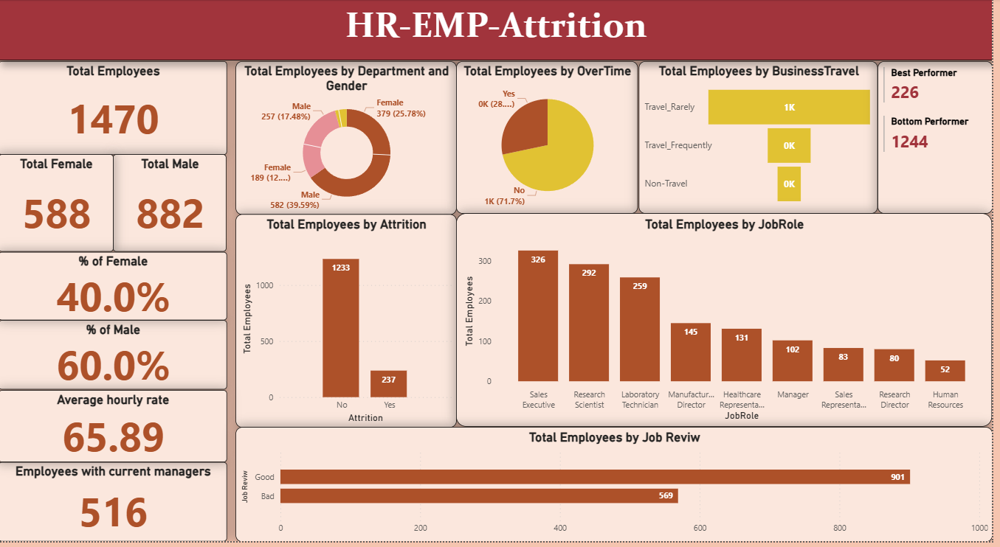

# HR_Employee_Attrition
A visual dashboard showing HR Employee Attrition analytics in Power BI.

## Overview
This repository contains a Power-BI analytics solution designed to provide insights into the HR Employee Attrition of a Fictional Company.

The IBM HR Analytics Employee Attrition & Performance Data dataset is a fictional dataset created by IBM data scientists. It contains different attributes of an employee and the target variable Attrition. It includes various attributes such as Education, Environment Satisfaction, Job Involvement, Job Satisfaction, Performance Rating, Relationship Satisfaction, Work-Life Balance, and more. The dataset can be downloaded from the Kaggle website.

The Key Performance Indicators (KPIs) used in the analysis are enlisted in the document 'Analyzation(Requirements).docx'. 

## Project Structure

project   
├── README.md # Documentation  
├── datasets/ # raw and cleaned data sources  
├── visuals/ # exported screenshots of dashboards  
├── reports/ # Power BI project files (.pbip)  
└── Analyzation(Requirements).docx

## Technologies Used

* Power BI Desktop - Data Modeling and Visualization
* SQL or Python - Data preprocessing and ETL
* GitHub - Version Control and Collaboration

## Key Features

* Interactive Dashboards with drill-down filters
* Trend Analysis and Forecasting
* KPI tracking across multiple dimensions
* Exportable reports for stakeholders

## Setup Instructions

* Clone the repository
* Open the .pbip file in Power BI Desktop
* Update the data source connections in dataset settings
* Refresh the report to load data

## Dashboard Preview

  

## Contributing

Contributions are Welcome!

* Fork the Repository
* Create a Feature Branch
* Submit a Pull Request

